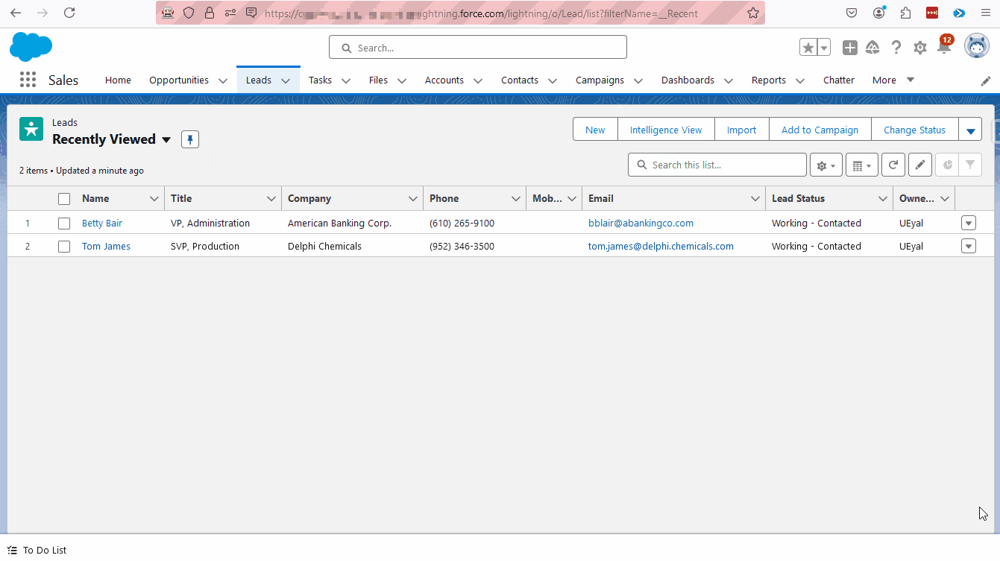

# Salesforce Commander

Get more done in Salesforce - list and search records, make new ones, find faster  or login as on the fly!
This extension helps you get to any Salesforce page quickly. Just type in what you need to do!

For example, 
- Instead of Navigating to Object Manager -> Accounts -> Triggers --> "myAccountTrigger",   Enter "Account Triggers <TAB> myAcc" and access that trigger directly.
  
- Instead of Navigating to Setup -> Users -> Permission Sets -> My Permission set,  Enter "Permis Set <TAB> my" and access it directly.
  

Compatible with Firefox and Chrome

Press <kbd>Ctrl</kbd>-<kbd>Shift</kbd>-<kbd>Space</kbd> to open the Commander bar and:
- Enter "List [Object] <kbd>Enter</kbd>" to get to the object list. 
- Enter "List [Object] <kbd>Tab</kbd>" to see the the available listviews for this object, and choose one. 
- Enter "Setup [Object] fields<kbd>Tab</kbd>" to see the list of fields, and choose one using arrow keys+<kbd>Enter</kbd> or mouse.
- Enter "Users <kbd>Tab</kbd> [partial name]"
  - Press "Users <kbd>Tab</kbd>" to show all defined users and access their details directly.  
- Direct access to subpages for different objects like:
    - Access user pages directly by typing "users [partial name]"
    use- Access custom object fields directly "[object name] fields <kbd>Tab</kbd> [field name]". For Example "account fields Tab name"

#### More Examples :
* Account Fields
* Case Triggers
* Customer Validation Rules
* Permission Sets
* Permission set Groups
* List Profiles
* Asset Page layouts
* Home
* Setup 
* Run Report [report name]
* Login as [partial match of username]
#### Searching
To search for a specific object, open the Commander bar and enter "? Object Value".   For example, "? Account Sony" or "?Contact John".

 

** You can hold shift or control when you press enter or click your mouse to open the selected item in a new tab **

### Default shortcut keys

Default shortcut key is <kbd>Ctrl</kbd>-<kbd>Shift</kbd>-<kbd>Space</kbd> to open the command bar.
(or <kbd>Command</kbd>-<kbd>Shift</kbd>-<kbd>Space</kbd> on Mac)

Alternativly:  <kbd>Ctrl</kbd>-<kbd>Space</kbd>

### Customize shortcuts at:
- Chrome - chrome://extensions/shortcuts
- Firefox - about://addons --> Manage Extension shortcuts

NOTE: If you have a custom instance Domain Name, you may have to create a CSP Trusted Site Definition for your Classic domain URL in order for this extension to work - more info here https://developer.salesforce.com/docs/atlas.en-us.lightning.meta/lightning/csp_trusted_sites.htm

Contribute to this extension at https://github.com/uris-tools/Salesforce-Commander

## Maintainer(s):
[Uri Eyal](uri@eyal.es)

##### Based on force-navigator by [Danny Summerlin](http://summerlin.co) ,  Salesforce Navigator by [Daniel Nakov](https://twitter.com/dnak0v), and [Wes Weingartner](https://twitter.com/wes1278)

## License
[MIT License](http://en.wikipedia.org/wiki/MIT_License)

## Privacy Policy
This extension only runs locally in communication with your instance of Salesforce. No data is collected from any user, nor is extension activity tracked or reported to a third-party.

## Terms of Service
This extension is not intended to support the work of any individual or organization that is discriminatory or outright illegal.